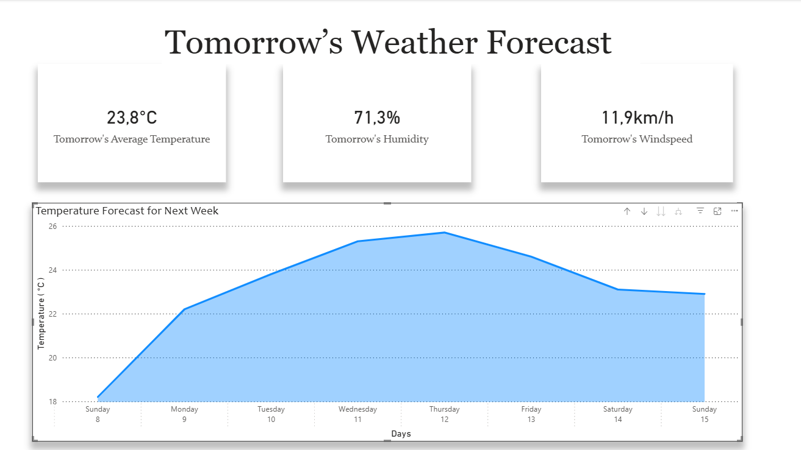
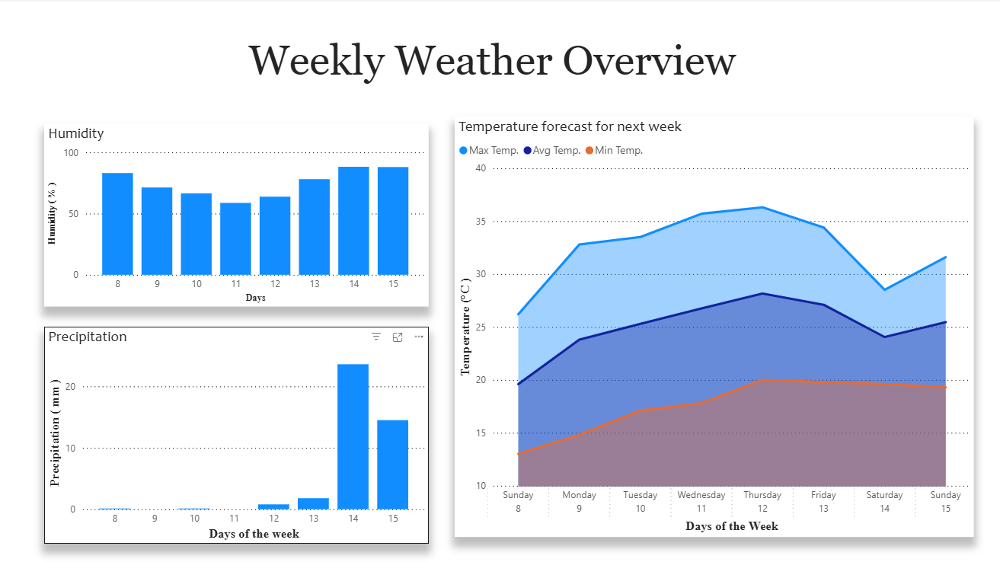

🌦️ Weather Forecast Data Pipeline (Airflow + PostgreSQL + Power BI)
📌 Project Overview

This project is an end-to-end Weather Forecast Data Pipeline built with Apache Airflow, designed to extract, transform, and load (ETL) weather forecast data into a PostgreSQL database, making it ready for analytics and visualization.

The pipeline fetches forecast data from the Visual Crossing Weather API, processes and cleans the dataset using Pandas, loads it into PostgreSQL with UPSERT logic to prevent duplicate records, and finally connects the database to a Power BI dashboard for interactive reporting.

This project was fully containerized using Docker Compose, ensuring portability and easy deployment.

## 🚀 Tech Stack

- Python
- Apache Airflow
- PostgreSQL
- Pandas
- psycopg2
- Docker / Docker Compose
- Power BI
- Visual Crossing API

## 🎯 Main Features

- ✅ Automated daily forecast ingestion using **Airflow DAG scheduling**
- ✅ Extraction of weather forecast data via **Visual Crossing API**
- ✅ Data transformation and enrichment using **Pandas**
- ✅ Generation of **raw and processed CSV backups**
- ✅ Load into **PostgreSQL** with automatic table creation
- ✅ **UPSERT** implementation to prevent duplicate data and allow updates
- ✅ **Power BI dashboard** connected to PostgreSQL for visualization

🏗️ Pipeline Architecture

The ETL process is implemented in a Python module called:

📌 pipeline_tempo.py (or Pipeline Tempo)

It contains three main functions:

1) extrair_dados(cidade, dias)

Builds the API URL using the selected city and forecast range.
Fetches data directly from Visual Crossing.
Loads the API response into a Pandas DataFrame.
Saves the raw dataset into a CSV file for backup and debugging.

Output: Raw DataFrame


2) processar_dados(df)

Receives the raw DataFrame.
Creates new derived columns.
Filters only relevant columns for analytics.
Saves the cleaned dataset into another CSV file.

Output: Processed DataFrame


3) carregar_postgre(df, tabela="previsao_tempo")

Connects to PostgreSQL using psycopg2.
Creates the table if it does not exist.
Inserts the records into PostgreSQL.
Uses UPSERT logic (INSERT ... ON CONFLICT DO UPDATE) to prevent duplicates.

Output: None (writes data into PostgreSQL)

⏳ Airflow DAG Orchestration

The ETL process is orchestrated using an Apache Airflow DAG.
The DAG imports the functions from the pipeline module and executes them as tasks in the correct order:

Extract Task → calls extrair_dados()
Transform Task → calls processar_dados()
Load Task → calls carregar_postgre()

The DAG is scheduled to run daily.

📌 DAG Name: pipeline_clima
📌 Schedule: @daily

🐳 Dockerized Environment

The entire Airflow environment runs inside Docker containers using Docker Compose.

The project includes:
docker-compose.yml for orchestrating Airflow + PostgreSQL
Dockerfile for installing Python dependencies (requirements.txt)

Mounted volumes for:

DAGs
Logs
Scripts / pipeline code
Generated CSV backups
This ensures the project can be executed consistently on any machine.

## 📂 Project Structure

```bash
airflow-tempo-projeto
│
├── PowerBIImages
│   ├── page1_powerbiweekforecast.png
│   └── page2_powerbiweekforecast.png
├── airflow
│   ├── dags
│   │   └── pipeline_clima.py
│   └── logs    
├── data
│   ├── processed
│   │   └── previsao_tempo_limpo.csv
│   └── raw
│       └── previsao_tempo.csv
├── docker
│   ├── Dockerfile
│   ├── docker-compose.yml
│   └── requirements.txt
├── sql
│   └── create_tables.sql
├── src
│   └── pipeline_tempo.py
└── README.md 
```


## 🗄️ Table Schema (PostgreSQL)

The pipeline loads data into the following table:

📌 **Table name:** `previsao_tempo`

```sql
CREATE TABLE previsao_tempo (
    name TEXT NOT NULL,
    datetime TIMESTAMP NOT NULL,

    tempmax DOUBLE PRECISION,
    tempmin DOUBLE PRECISION,
    temp DOUBLE PRECISION,
    feelslike DOUBLE PRECISION,
    precip DOUBLE PRECISION,
    humidity DOUBLE PRECISION,
    windspeed DOUBLE PRECISION,

    avg_temp DOUBLE PRECISION,
    temp_range DOUBLE PRECISION,
    day_of_week TEXT,

    collected_at TIMESTAMP DEFAULT CURRENT_TIMESTAMP,

    CONSTRAINT pk_previsao_tempo PRIMARY KEY (name, datetime)
);
```

📊 Power BI Dashboard

After the ETL process loads the data into PostgreSQL, the database is connected to Power BI for visualization.

The Power BI report includes two main pages:

📌 1) Tomorrow’s Weather Forecast

This page focuses on:

Tomorrow’s forecast highlights
    Average Temperature
    Humidity
    Wind speed

It also includes a chart about the Temperature Forecast for Next Week

📌 2) Weather Overview

This page provides:

Full week forecast analysis
    Humidity
    Precipitation
    Temperature forecast for the next week(including Max temp, Avg Temp, Min temp.)

 - The dashboard updates when Power BI refresh is triggered, pulling the latest data directly from PostgreSQL.

## 📸 Power BI Dashboard Preview

### Tomorrow’s Weather Forecast


### Weather Overview

